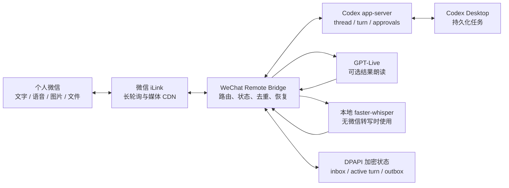

# WeChat Remote Bridge for Codex

[](https://github.com/liburce0412-alt/WeChat-remote-bridge-/releases)
[](LICENSE)


> A Windows-first bridge that lets a personal WeChat account continue and operate local Codex Desktop tasks.
>
> 通过个人微信远程续接和操作本机 Codex Desktop 任务。

这是一个面向个人自动化场景的实验性 Bridge。它复用微信 iLink 协议和本机 Codex
app-server，将微信中的文字、语音、图片与文件交给真实的 Codex 任务处理，并把进度和
结果可靠地送回微信。

项目不控制 Codex Desktop 窗口，不录制系统声音，也不需要单独配置 OpenAI API Key。
Codex 与 GPT-Live 使用本机 ChatGPT/Codex 登录态及对应额度。

> [!WARNING]
> 默认执行模式是 `approvalPolicy=never` 与 `danger-full-access`。这意味着绑定的微信
> 账号可以触发本机 Codex 执行命令和修改文件。请先阅读[安全说明](#安全说明)，不要把
> 本项目直接部署为多人共享服务。

## 目录

- [功能概览](#功能概览)
- [工作模式](#工作模式)
- [系统架构](#系统架构)
- [可靠性与恢复语义](#可靠性与恢复语义)
- [环境要求](#环境要求)
- [快速开始](#快速开始)
- [后台运行](#后台运行)
- [微信指令](#微信指令)
- [配置项](#配置项)
- [语音链路](#语音链路)
- [安全说明](#安全说明)
- [故障排查](#故障排查)
- [升级 Codex](#升级-codex)
- [开发与测试](#开发与测试)
- [项目结构](#项目结构)
- [已知限制](#已知限制)
- [参与项目](#参与项目)
- [许可证与第三方代码](#许可证与第三方代码)

## 功能概览

- 微信扫码登录、验证码处理、IDC 跳转、长轮询游标和上下文令牌管理。
- 仅接受首次扫码账号发来的私聊消息；忽略群聊和其他用户。
- 查看最近任务、搜索历史内容、续接已有任务或在最近项目中新建任务。
- 微信文字、语音转写、图片和文件均可作为 Codex 输入。
- 微信语音优先使用微信已有转写；没有转写时可在本机使用 faster-whisper。
- Codex 执行期间发送节流后的阶段进度，并支持查询当前状态或主动中断。
- 默认返回文字；可切换为 GPT-Live 音频附件回复。
- 结果中出现的本地文件可以通过微信 CDN 加密上传回微信。
- 消息 inbox、活动 turn、待回答问题和 outbox 均持久化。
- Windows 登录自启、独立 watchdog、进程心跳和假死重启。
- 任务目录允许列表与可选 `workspace-write` 安全模式。

## 工作模式

| 模式 | 微信文字输入 | 微信语音输入 | 中间进度 | 最终结果 |
| --- | --- | --- | --- | --- |
| 默认模式 | Codex turn | 转写后进入 Codex turn | 文字 | 文字 |
| 语音模式 | Codex turn | 转写后进入 Codex turn | 文字 | GPT-Live 生成 WAV 音频附件 |

语音模式不会把同一任务再交给另一个模型执行。Codex 先完成任务，GPT-Live 只负责朗读
已经生成的最终结果。朗读失败时，Bridge 会发送原文字结果，不会重复执行任务。

当前 iLink AI 联系人链路不能稳定发送原生微信语音气泡，因此输出格式是普通 WAV
文件附件。附件名称默认为 `GPT-Live语音.wav`，可通过环境变量自定义。

## 系统架构



### 消息处理流程

1. Bridge 通过 iLink 长轮询接收消息，并按微信消息 ID 去重。
2. 收到的消息先进入持久化 inbox。
3. Bridge 解析命令、附件和语音转写，确认要操作的 Codex 任务。
4. 消息提交给 Codex 后标记为已派发，避免进程重启后再次执行。
5. Codex 的活动 turn、阶段信息和待回答问题持续写入状态。
6. 最终文字、结果文件或待生成语音先进入 outbox。
7. 微信确认发送成功后，outbox 项才会删除。

## 可靠性与恢复语义

本项目把“不要重复执行任务”和“不要丢失回复”分开处理。

### 输入侧

- 微信消息先落入 inbox，再开始路由。
- 同一消息 ID 不会被重复加入。
- Codex 接受任务后，即使 Bridge 随后退出，也不会自动重新提交这条任务。
- Bridge 重启后会读取原 turn 状态；若任务已完成，则继续执行结果投递。
- 如果候选任务续接失败，候选列表会保留，用户可以修复问题后重新选择。

### 输出侧

outbox 支持三种持久化项目：

- `text`：文字回复。
- `file`：普通文件或已经生成的音频附件。
- `speech`：尚未交给 GPT-Live 朗读的最终正文。

语音模式下，Bridge 先保存 `speech` 项，再调用 GPT-Live。音频生成后先写入本机临时
WAV，再把 outbox 项转换为 `file`。服务在任何一步重启，都只会恢复朗读或发送，不会
重跑 Codex 任务。

长文字的每个分片以及文件消息都使用稳定 client ID，网络重试时保持不变，以降低重复
消息概率。

### 任务搜索

当 app-server 搜索结果不足时，Bridge 会使用本地只读后备索引：

- 标题来自 `session_index.jsonl`。
- 正文只提取用户和助手的真实对话记录，不索引基础指令或工具噪声。
- 索引按文件大小和修改时间增量更新，并持久化到 Bridge 数据目录。
- 单次更新有约 1.5 秒时间预算。
- 超大 rollout 只读取最近 16 MB，避免一次搜索同步扫描数 GB 会话文件。

### 网络与进程恢复

- 微信长轮询失败后使用带抖动的指数退避，最长等待五分钟。
- 网络恢复时只写一条汇总日志，避免相同错误持续刷屏。
- Codex RPC 默认 30 秒超时。
- 微信 CDN 上传和下载使用 60 秒超时，并进行有限重试。
- Bridge 每 30 秒写入一次心跳。
- watchdog 每分钟检查主任务；进程退出或心跳超过三分钟未更新时重新启动。
- Codex app-server 意外退出时，Bridge 主进程结束并交由 watchdog 恢复。

## 环境要求

### 必需

| 组件 | 要求 |
| --- | --- |
| 操作系统 | Windows 10 或 Windows 11 |
| Node.js | 22 或更高版本；开发与 CI 推荐 Node.js 24 |
| PowerShell | PowerShell 7，命令名为 `pwsh` |
| Codex | Codex Desktop 已安装并登录 ChatGPT |
| 微信 | 可扫码登录 iLink AI 联系人 |

### 本地语音转写

只有在微信语音消息没有自带转写时，才需要本地转写环境：

- Python 3，可通过 Windows `py -3` 启动。
- `faster-whisper` 与其运行依赖。
- NVIDIA CUDA 设备。
- 已下载的 faster-whisper 模型，或显式配置模型目录。

当前转写 worker 固定使用 CUDA 和 `int8_float16`。没有 GPU 的环境仍可使用文字、图片、
文件以及带微信转写的语音消息。

## 快速开始

### 1. 获取源码

```powershell
git clone https://github.com/liburce0412-alt/WeChat-remote-bridge-.git
Set-Location .\WeChat-remote-bridge-
```

### 2. 安装依赖并构建

```powershell
npm ci
npm run build
```

项目固定安装兼容的 `@openai/codex` 版本。Bridge 运行时会直接读取已安装包的版本，
不维护第二份硬编码版本号。

### 3. 扫码绑定微信

```powershell
npm run setup
```

终端会显示二维码。扫码完成后：

- bot token、绑定用户和 iLink 地址使用 Windows DPAPI 加密保存。
- 加密内容只能由同一 Windows 用户解密。
- 凭据不会写进项目目录或 Git 仓库。

### 4. 检查环境

```powershell
npm run doctor
```

`doctor` 会检查 Node.js、固定 Codex 运行时、微信凭据、本地 CUDA 转写环境、模型目录和
当前安全模式。

### 5. 前台运行

```powershell
npm start
```

前台运行适合首次测试。确认可以在微信中收到 Bridge 回复后，再安装后台服务。

## 后台运行

### 安装登录自启

```powershell
node dist/cli.js install-autostart
```

该命令会创建两个 Windows 计划任务：

- `WeixinCodexBridge`：运行 Bridge 主进程。
- `WeixinCodexBridgeWatchdog`：每分钟检查主任务和心跳。

### 服务控制

```powershell
node dist/cli.js start-service
node dist/cli.js stop-service
node dist/cli.js status
```

`status` 会显示：

- 微信是否已配置。
- 当前绑定任务。
- 语音模式开关。
- inbox 和 outbox 数量。
- 活动 turn。
- 最近心跳、进程 PID 和数据目录。

`stop-service` 会同时停止并禁用 Bridge 与 watchdog，适合维护或升级。

### 卸载登录自启

```powershell
node dist/cli.js uninstall-autostart
```

## 微信指令

| 指令 | 作用 |
| --- | --- |
| `继续 <任务名称或历史内容>` | 搜索并续接已有任务 |
| `新任务 <完整需求>` | 选择最近项目并创建任务 |
| `新任务` / `新建任务` | 进入新任务需求输入状态 |
| `最近` | 查看最近任务和项目 |
| `当前` / `查看情况` / `进度` | 查看绑定任务和执行状态 |
| `换个任务` | 解除当前绑定并显示候选任务 |
| `停止` | 中断当前 turn 并清理后台终端 |
| `取消绑定` | 解除当前任务绑定 |
| `语音模式` / `/voice on` | 最终结果改为 GPT-Live 音频附件 |
| `退出语音` / `/voice off` | 恢复文字结果并释放语音会话 |
| `结束语音会话` / `/voice stop` | 只释放当前语音会话，保留模式开关 |
| `语音状态` / `/voice status` | 查看模型、声音、协议和连接状态 |
| `关闭服务` | 停止 Bridge 并禁用 watchdog |
| `帮助` | 显示微信端帮助 |

候选列表会读取所有未归档任务，每页显示 10 项，只显示简单序号和任务名称，不暴露内部
`codex://` 地址。可以回复当前页序号、完整名称、唯一的名称片段，或使用“下一页”和
“上一页”浏览全部候选。

## 配置项

Bridge 直接读取进程环境变量，不会自动加载 `.env` 文件。仓库中的
[`.env.example`](.env.example) 仅作为配置清单。

| 变量 | 默认值 | 说明 |
| --- | --- | --- |
| `WEIXIN_CODEX_DATA_DIR` | `%LOCALAPPDATA%\WeixinCodexBridge` | 加密状态、日志、心跳、索引和临时媒体目录 |
| `WEIXIN_CODEX_WHISPER_MODEL` | 自动查找 Hugging Face 缓存 | 本地 faster-whisper 模型目录 |
| `WEIXIN_CODEX_REALTIME_MODEL` | `gpt-live-1-codex` | GPT-Live 模型 |
| `WEIXIN_CODEX_REALTIME_VOICE` | `sol` | GPT-Live 声音 |
| `WEIXIN_CODEX_REALTIME_IDLE_MS` | `300000` | 空闲语音会话释放时间 |
| `WEIXIN_CODEX_REALTIME_OUTPUT_TIMEOUT_MS` | `30000` | Realtime 普通输出等待时间 |
| `WEIXIN_CODEX_AUDIO_FILENAME` | `GPT-Live语音.wav` | 微信音频附件名称；缺少 `.wav` 时自动补全 |
| `WEIXIN_CODEX_ALLOWED_ROOTS` | 未限制 | 允许操作的项目根目录，Windows 下用分号分隔 |
| `WEIXIN_CODEX_SAFE_MODE` | `0` | 设为 `1` 后使用 `workspace-write` 并拒绝越界批准 |
| `WEIXIN_CODEX_DEBUG` | 未设置 | 设置任意非空值后输出 debug 日志 |
| `CODEX_HOME` | `%USERPROFILE%\.codex` | Codex 数据目录，高级配置 |

### 临时配置

只对当前 PowerShell 会话生效：

```powershell
$env:WEIXIN_CODEX_AUDIO_FILENAME = "Assistant Reply.wav"
$env:WEIXIN_CODEX_ALLOWED_ROOTS = "C:\Projects;D:\Work"
$env:WEIXIN_CODEX_SAFE_MODE = "1"
npm start
```

### 持久配置

后台计划任务需要用户级或系统级环境变量。以下示例写入当前 Windows 用户：

```powershell
[Environment]::SetEnvironmentVariable(
  "WEIXIN_CODEX_ALLOWED_ROOTS",
  "C:\Projects;D:\Work",
  "User"
)
[Environment]::SetEnvironmentVariable(
  "WEIXIN_CODEX_SAFE_MODE",
  "1",
  "User"
)
```

写入后重新登录 Windows，或停止并重新创建后台任务，使新进程获得更新后的环境。

## 语音链路

### 微信语音输入

1. 如果 iLink 消息包含转写文本，Bridge 直接使用该文本。
2. 如果没有转写，Bridge 下载并解密 SILK 媒体。
3. `silk-wasm` 将语音解码为 24 kHz 单声道 PCM16。
4. PCM 被封装为临时 WAV，交给本地 faster-whisper。
5. 低于置信度阈值的结果不会执行，以免误操作。
6. 识别结果作为普通 Codex turn 输入。

默认模式下，即使用户发来语音，最终回复仍是文字。只有显式开启语音模式后，最终回复
才会成为音频附件。

### GPT-Live 输出

1. Codex 完成任务并生成最终文字。
2. Bridge 清理 Markdown 代码块、链接、URL 和本地路径，生成适合朗读的文本。
3. 朗读文本限制为 1200 字符，超时时间根据长度动态调整，范围为 30 到 120 秒。
4. Bridge 通过 Codex app-server 的实验性 Realtime 会话调用 GPT-Live。
5. PCM16 音频块合并后封装为 WAV。
6. WAV 进入可靠 outbox，再上传为普通微信文件附件。

模型无效时会尝试 Codex 默认模型；朗读失败时只发送文字回退，不调用额外 TTS，也不
重新执行 Codex 任务。

GPT-Live 使用 ChatGPT Voice 额度。出现 `You have reached your usage limit` 时，需要
等待 Voice 额度恢复。

## 安全说明

### 默认模式

默认配置用于单用户、无人值守的远程自动化：

- `approvalPolicy=never`
- `danger-full-access`
- Bridge 自动接受 app-server 发来的命令和文件修改批准请求

这提供了最完整的远程操作能力，也意味着微信账号和 Windows 会话都属于高价值凭据。

### 建议的安全配置

至少限制项目根目录：

```powershell
$env:WEIXIN_CODEX_ALLOWED_ROOTS = "C:\Projects;D:\Work"
```

需要更严格限制时开启安全模式：

```powershell
$env:WEIXIN_CODEX_SAFE_MODE = "1"
```

安全模式使用 `workspace-write`，并拒绝需要越界批准的命令或文件修改。部分需要网络、
系统目录或项目外文件的任务会因此失败，这是预期行为。

### 数据与隐私

- 微信凭据与 Bridge 状态使用 Windows DPAPI 加密。
- 日志会遮盖常见 token、上下文令牌、typing ticket 和 AES key。
- 接收的附件、临时 WAV 和任务搜索索引保存在 Bridge 数据目录。
- Codex 任务内容会进入本机 Codex app-server。
- 开启语音模式时，最终朗读文本会发送给 GPT-Live。
- 项目不是多租户系统，不提供独立用户权限、审计后台或远程管理面板。

## 故障排查

### `npm run doctor` 失败

先重新构建，确保 `dist` 与源码一致：

```powershell
npm ci
npm run build
npm run doctor
```

如果只有本地 Whisper 或 CUDA 检查失败，文字和带微信转写的语音仍可能可用；没有转写
的语音消息会失败。

### 提示任务版本高于 Bridge 运行时

桌面版创建任务时使用的 Codex 版本比 Bridge 固定依赖更新。使用升级脚本安装相同或更
高版本，然后重新构建并重启服务。

### 提示任务正在另一个客户端执行

Bridge 会同时检查 Codex 状态数据库和 rollout 中的开放 turn。请先停止桌面端任务，
不要让桌面端与微信同时操作同一任务。

### 微信消息没有回复

```powershell
node dist/cli.js status
Get-Content "$env:LOCALAPPDATA\WeixinCodexBridge\bridge.log" -Tail 100
```

重点检查：

- 主任务是否为 `Running`。
- 心跳是否在三分钟内更新。
- inbox 或 outbox 是否持续积压。
- 日志中是否有 iLink 凭据失效、网络代理或 CDN 错误。

长轮询网络故障会指数退避。恢复后 Bridge 会继续使用持久化 inbox/outbox。

### 语音模式只收到文字

常见原因：

- ChatGPT Voice 额度已经用完。
- GPT-Live Realtime 会话建连失败。
- 朗读超时或只返回了 transcript，没有音频。
- 微信 CDN 音频附件上传失败。

Bridge 会在这些情况下发送文字回退。查看 `语音状态` 和 `bridge.log` 可获得具体原因。

### 无法收到原生微信语音气泡

这是当前 iLink AI 联系人链路的限制，不是 WAV 编码错误。项目只发送普通音频文件附件。

### 提示 `Bridge 已在运行`

同一 Windows 用户只允许一个 Bridge 主进程。先查看计划任务和状态，不要同时运行
`npm start` 与后台服务。

## 升级 Codex

使用仓库提供的脚本升级固定依赖：

```powershell
pwsh -File .\scripts\upgrade-codex.ps1 -Version <目标版本>
```

脚本会：

1. 精确安装指定版本的 `@openai/codex`。
2. 执行严格类型检查。
3. 运行测试。
4. 重新构建。

验证成功后重启后台服务：

```powershell
node dist/cli.js stop-service
node dist/cli.js start-service
```

脚本不会修改或覆盖微信 DPAPI 状态。

## 开发与测试

### 常用命令

```powershell
npm run typecheck
npm test
npm run build
npm run check
```

`npm run check` 会依次执行类型检查、单元测试和构建。

### 真实集成测试

真实 Codex、GPT-Live、微信和本地转写测试默认跳过，避免 CI 使用开发机登录态、发送
微信消息或消耗 Voice 额度。

| 环境变量 | 作用 |
| --- | --- |
| `RUN_CODEX_INTEGRATION=1` | 连接真实 Codex app-server |
| `RUN_REALTIME_INTEGRATION=1` | 连接真实 GPT-Live |
| `REALTIME_EXISTING_THREAD_ID=<id>` | 使用已有任务测试 Realtime |
| `RUN_WEIXIN_VOICE_E2E=1` | 向已绑定微信发送真实音频附件 |
| `RUN_TRANSCRIBER_INTEGRATION=1` | 加载真实本地 Whisper CUDA 模型 |

启用真实测试前，请确认当前没有在 Codex Desktop 中执行同一任务。

### GitHub Actions

Windows 工作流模板位于 [`ci/windows.yml`](ci/windows.yml)。将其复制到
`.github/workflows/ci.yml` 即可启用。执行该提交的 GitHub OAuth token 需要
`workflow` 权限。

## 项目结构

```text
.
├─ src/
│  ├─ bridge.ts              # 微信路由、任务选择与 turn 生命周期
│  ├─ delivery.ts            # 可靠文字、文件和语音 outbox
│  ├─ state.ts               # DPAPI 状态、schema 与可恢复写队列
│  ├─ transcription.ts       # 常驻 faster-whisper worker 客户端
│  ├─ codex/
│  │  ├─ client.ts           # Codex app-server JSON-RPC
│  │  ├─ realtime.ts         # GPT-Live 会话管理
│  │  ├─ webrtc-peer.ts      # WebRTC 音频传输
│  │  ├─ fulltext-index.ts   # 增量本地任务搜索
│  │  └─ activity.ts         # 并发 turn 检查
│  └─ weixin/
│     ├─ client.ts           # iLink 请求、发送与 CDN 上传
│     ├─ login.ts            # 扫码和凭据刷新
│     ├─ media.ts            # 媒体下载、解密、SILK 与 WAV
│     └─ types.ts            # iLink 消息类型
├─ scripts/
│  ├─ install-autostart.ps1  # 安装 Windows 计划任务
│  ├─ watchdog.ps1           # 进程与心跳守护
│  ├─ upgrade-codex.ps1      # 固定版本升级与验证
│  └─ transcribe_worker.py   # faster-whisper 常驻 worker
├─ test/                     # 单元测试和可选真实集成测试
├─ ci/windows.yml            # GitHub Actions 模板
├─ CONTRIBUTING.md           # 开发与提交规范
├─ SECURITY.md               # 漏洞报告方式
├─ CHANGELOG.md              # 版本变更记录
├─ LICENSE                   # MIT 许可证
└─ THIRD_PARTY_NOTICES.md
```

## 已知限制

- 仅支持 Windows。
- iLink 属于实验性个人微信 AI 联系人链路，协议可能变化。
- Codex Realtime 接口为实验性接口，升级后可能需要适配。
- 不能发送原生微信语音气泡，只能发送 WAV 文件附件。
- 不支持群聊、多用户权限或多人共享。
- 本地无转写语音目前只支持 CUDA faster-whisper。
- 本地后备搜索对超大 rollout 只索引最近 16 MB，不保证命中任意早期内容。
- 安全模式不是容器或虚拟机隔离；它依赖 Codex sandbox 行为。

## 参与项目

- 提交 Bug 或功能建议前，请阅读 [`CONTRIBUTING.md`](CONTRIBUTING.md)。
- 安全漏洞不要发布到公开 Issue，请按 [`SECURITY.md`](SECURITY.md) 私下报告。
- 版本变化见 [`CHANGELOG.md`](CHANGELOG.md)。
- 参与讨论和贡献代码即表示同意遵守 [`CODE_OF_CONDUCT.md`](CODE_OF_CONDUCT.md)。

## 许可证与第三方代码

本项目以 [MIT License](LICENSE) 开源。

`src/weixin/` 中的 iLink 适配源自腾讯
`@tencent-weixin/openclaw-weixin@2.4.6`，其 MIT 许可证文本见
[`THIRD_PARTY_NOTICES.md`](THIRD_PARTY_NOTICES.md)。
